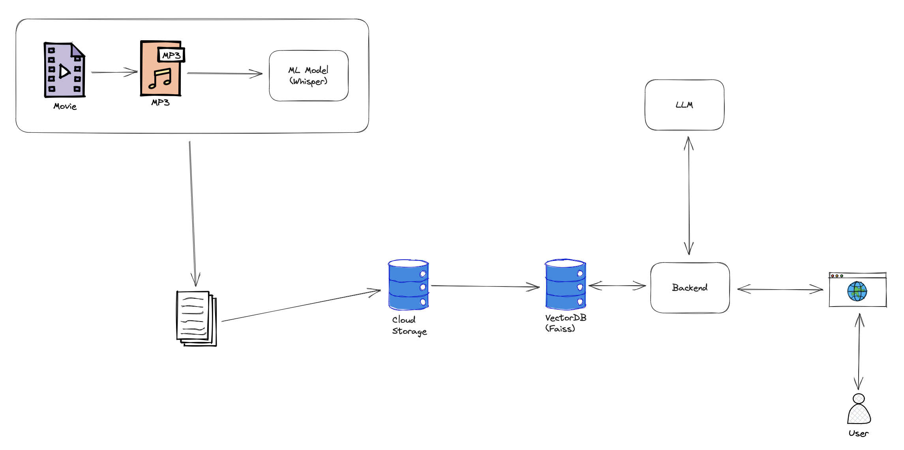

# Study-Search 📝

## About project:

The project uses the WHISPER machine learning model to automatically convert lecture recordings for the {subject_name} subject into text files, which can be easily searched and processed. The WHISPER model uses speech recognition technology to accurately transcribe audio recordings into text.

Next, a vector database such as FAISS was used to implement a QA (Question Answering) search engine, which allows users to find answers to questions related to the material covered in the lecture. The langchain library was used to integrate different language models.

As part of the project, LLM (Large Language Model) was also utilized, which are language models with a large number of parameters that learn from large sets of texts. This allows the project to use advanced natural language processing techniques, resulting in accurate and comprehensive answers to questions posed.

Ultimately, this project utilizes artificial intelligence technology to automate the process of converting lecture recordings into text files, making it easier to search for information and answer questions related to the subject.

## Tech-Stack:
- MongoDB: 📚
- FAISS: 🔎
- FFMPEG: 🎥
- WHISPER: 🔊
- LangChain: 🦜
- OpenAI: 🧠

## Overview


## Installation guide:

### Create virtualenv
```shell
virtualenv env
```

### Install dependencies
```shell
make prod_env
```

### Create and fill .env
```py
OPENAI_API_KEY=""
MONGODB_PASSWORD=""
MONGODB_URI=""
INDEX_NAME=""
LLM_MODEL=""
BACKEND="http://127.0.0.1:8000/query"
EMBEDDINGS_PICKLE="emb.pkl"
CACHE_DIR="data/cache"
```

## Run APP

##### Backend
```shell
make backend
```

##### Frontend
```shell
make frontend
```
